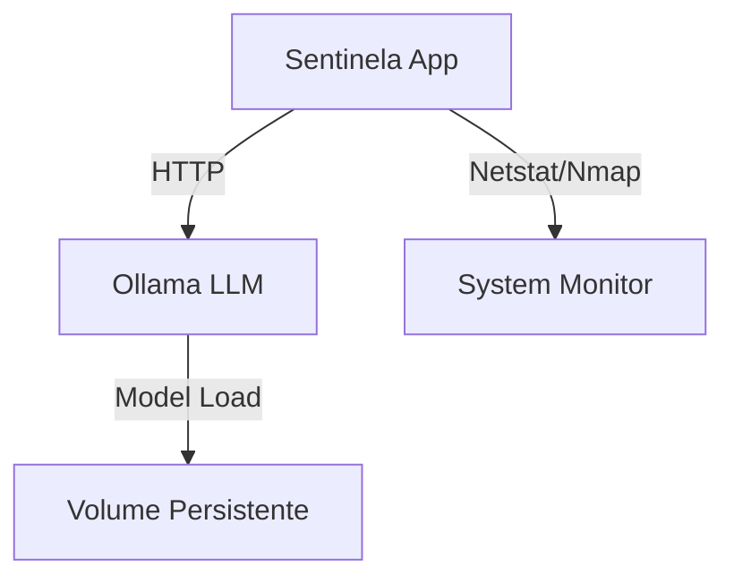

# Sentinela 🛡️

# 🛡️ Sentinela

Sentinela é um EDR experimental open-source que integra monitoramento de sistema com análise via LLM local (Ollama), executando totalmente offline.


## Arquitetura

O Sentinela roda em uma arquitetura moderna e containerizada, separando responsabilidades entre o agente de monitoramento e o motor de inferência IA.



### Componentes

- **Sentinela App (`app/`)**: Core em Python que orquestra varreduras e análise.
- **Scanner**: Módulo que utiliza `nmap` e `psutil` para mapear a superfície de ataque local.
- **LLM Client**: Interface de comunicação com a API do Ollama.
- **Ollama**: Servidor de inferência executando o modelo `llama3` (ou `phi3`) isolado.

---

## 🚀 Como Rodar (Docker Compose)

A forma recomendada de execução é via Docker Compose, que sobe todo o ambiente com uma única linha de comando.

### Pré-requisitos
- Docker e Docker Compose instalados

### Execução

```bash
git clone https://github.com/MiguelFAraujo/Sentinela
cd Sentinela
docker compose up --build
```

O sistema irá automaticamente:
1. Baixar as imagens necessárias.
2. Iniciar o servidor Ollama.
3. Baixar o modelo de IA (na primeira execução).
4. Iniciar o agente Sentinela e realizar a primeira varredura.

---

## 📦 Desenvolvimento e Estrutura

O projeto utiliza **uv** para gerenciamento de dependências e ambientes virtuais, garantindo builds reprodutíveis e rápidos.

### Estrutura do Projeto

```
Sentinela/
├── app/                 # Código fonte da aplicação
│   ├── agente.py        # Entrypoint
│   ├── scanner.py       # Lógica de varredura
│   ├── llm.py           # Integração com IA
│   └── config.py        # Configurações
├── scripts/             # Scripts utilitários (wait-for-ollama)
├── tests/               # Testes automatizados
├── .github/             # Workflows de CI/CD
├── Dockerfile           # Definição da imagem Docker
└── docker-compose.yml   # Orquestração dos serviços
```

### Comandos Úteis

Atualizar dependências:
```bash
uv add <lib>
uv lock
```

Rodar testes localmente:
```bash
uv run python -m unittest discover tests
```

---

## 🤝 Contribuições

Contribuições são bem-vindas! Por favor, abra uma issue ou pull request para melhorias e correções.

## 📄 Licença

Este projeto é distribuído sob a licença MIT. Veja o arquivo `LICENSE` para mais detalhes.

Copyright (c) 2026 Miguel F Araujo


---

## 💻 Instalação Manual (Windows/PowerShell)

```
--------------------------------------------------
INICIANDO PROTOCOLO SENTINELA V3.0
--------------------------------------------------
Sentinela: Iniciando varredura PROFUNDA em 192.168.1.50...
   > Host encontrado: 192.168.1.50
     -> Porta 135: open | Software Real: svchost.exe (PID: 1104)
     -> Porta 445: open | Software Real: System (PID: 4)
     -> Porta 5938: open | Software Real: TeamViewer.exe (PID: 8832)

Sentinela: Enviando verdade técnica para o Phi-3...

RELATÓRIO DO ANALISTA:

1. Sim, o TeamViewer em Wi-Fi público representa risco significativo...
2. As portas 135 e 445 com o processo System são normais no Windows...
3. Recomendação: Desative o TeamViewer quando não estiver em uso...
```

---

## Avisos importantes

Este é um projeto educacional. Não substitui soluções profissionais de EDR. Use apenas em sua própria máquina e rede.

**Privacidade**: Os dados nunca saem do seu computador. O Phi-3 roda 100% local.

**Legalidade**: Não escaneie redes de terceiros sem autorização. É crime.

**Propósito**: Ferramenta de aprendizado para quem estuda segurança e quer entender como sistemas de detecção funcionam na prática.

---

## Sobre

Meu nome é Miguel F. Araújo. Estou estudando segurança cibernética na **Hackers do Bem** (turma fundamental), uma iniciativa brasileira focada em ethical hacking e defesa de sistemas.

Este projeto é parte do meu aprendizado. Se você também está começando na área de segurança, espero que o código seja útil para entender como integrar ferramentas básicas e criar algo funcional.

---

## Contribuições

Se quiser melhorar o projeto, fique à vontade para abrir issues ou pull requests. Algumas ideias:

- Suporte para Linux/macOS
- Interface web para visualizar os relatórios
- Exportar relatórios em JSON ou CSV
- Integração com alertas (email, Telegram)
- Melhorar os prompts da IA

---

## Licença

MIT License. Veja o arquivo `LICENSE` para detalhes.

---

**[GitHub](https://github.com/MiguelFAraujo) | Miguel F. Araújo | 2026**
