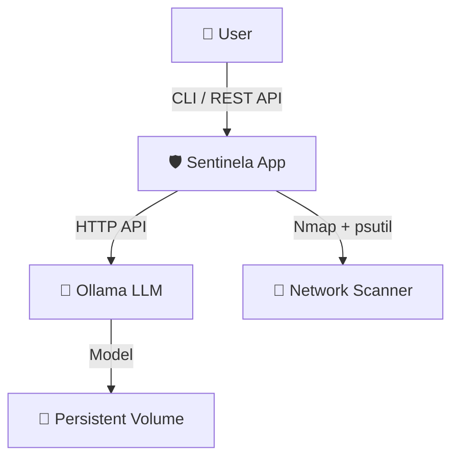

# 🛡️ Sentinela

**Experimental open-source EDR with local AI-powered analysis.**

Sentinela is an Endpoint Detection and Response system that combines network monitoring with intelligent analysis via a local LLM ([Ollama](https://ollama.ai)), running **100% offline** — your data never leaves your machine.


---

## Install with One Command

<details open>
<summary><strong>🐧 Linux & macOS</strong></summary>

```bash
curl -fsSL install.cat/MiguelFAraujo/Sentinela | sh
```
</details>

<details>
<summary><strong>🪟 Windows (PowerShell with Docker)</strong></summary>

```powershell
irm install.cat/MiguelFAraujo/Sentinela | iex
```
</details>

<details>
<summary><strong>🪟 Windows (Bare Metal / No Docker)</strong></summary>

```powershell
irm https://raw.githubusercontent.com/MiguelFAraujo/Sentinela/main/setup.ps1 | iex
```
*This Setup Wizard automatically installs Git, Nmap, Ollama, the AI model, and the Sentinela app directly to your machine.*
</details>

> Run the same command again at any time to **update** to the latest version.

---

## Quick Start / Command Manual

After installation, the comprehensive `sentinela` command is available directly in your terminal. Here is the manual of what each command does:

### 1. Starting the Service
```bash
sentinela up           # Starts all core services (API and AI engine) in the background
```
*Use this when you want to leave the Sentinela API running continuously to accept external requests.*

### 2. Scanning and Analysis
```bash
sentinela scan         # Runs a full network and process scan on your local machine
```
*This is the core feature. It maps open ports, identifies running processes, and sends the context to the local AI for a deep security analysis report.*

### 3. Monitoring and Management
```bash
sentinela logs         # Follows the real-time application and AI logs
sentinela status       # Shows the health status of background containers/services
```
*Use these commands to debug issues or check if the AI is still processing a large request.*

### 4. Lifecycle
```bash
sentinela update       # Fetches the latest code from GitHub and updates the system
sentinela down         # Completely stops all background services
```

---

## Why Sentinela? (vs. Competitors)

While enterprise EDRs (Endpoint Detection and Response) like CrowdStrike, SentinelOne, or Microsoft Defender are incredibly powerful, they come with a few trade-offs that Sentinela solves:

1. **Absolute Privacy (100% Offline AI)**:
   Commercial tools often upload your telemetry, process lists, and sometimes even files to their cloud for machine learning analysis. **Sentinela uses a local LLM (`llama3.2`)**. Your network topology and process data *never* leave your machine.
2. **Open Source & Transparent**:
   You can read exactly what the scanner is doing and what the AI is being prompted with. There are no black-box kernel drivers hidden from you.
3. **No Kernel Panic Risks**:
   Unlike traditional EDRs that install deep OS drivers (which can occasionally cause bluescreens globally), Sentinela operates entirely in user-space utilizing standard tools like Nmap and psutil.
4. **Forever Free**:
   No enterprise licenses, no SaaS subscriptions, and no paywalls. Sentinela is built for the community.

**API available at:** `http://localhost:3333`
**Interactive docs:** `http://localhost:3333/docs`

---

## Uninstall

<details>
<summary><strong>🐧 Linux & macOS</strong></summary>

```bash
curl -fsSL https://raw.githubusercontent.com/MiguelFAraujo/Sentinela/main/uninstall.sh | sh
```
</details>

<details>
<summary><strong>🪟 Windows (PowerShell)</strong></summary>

```powershell
irm https://raw.githubusercontent.com/MiguelFAraujo/Sentinela/main/uninstall.ps1 | iex
```
</details>

---

## Architecture

Sentinela runs on a containerized architecture with Docker, separating responsibilities between the monitoring agent and the AI inference engine.


```mermaid
graph TD
    A["🛡️ Sentinela App"] -->|HTTP API| B["🧠 Ollama LLM"]
    A -->|"Nmap + psutil"| C["📡 Network Scanner"]
    B -->|Model| D["💾 Persistent Volume"]
    E["👤 User"] -->|"CLI / REST API"| A
```

### Components

| Component | Description |
|---|---|
| **Sentinela App** (`app/`) | Python core — orchestrates scans and analysis via FastAPI |
| **Scanner** (`scanner.py`) | Nmap + psutil to map the local attack surface |
| **LLM Client** (`llm.py`) | Interface with the Ollama API (SOC prompt system) |
| **Ollama** | Inference server running `llama3.2` in an isolated container |

---

## Sample Output

```
━━━━━━━━━━━━━━━━━━━━━━━━━━━━━━━━━━━━━━━━━━━━━━━━━━
🚀 SENTINELA PROTOCOL (Target: 192.168.1.50)
━━━━━━━━━━━━━━━━━━━━━━━━━━━━━━━━━━━━━━━━━━━━━━━━━━
Host found: 192.168.1.50
  Port 135/tcp: OPEN running: svchost.exe (PID: 1104)
  Port 445/tcp: OPEN running: System (PID: 4)
  Port 5938/tcp: OPEN running: TeamViewer.exe (PID: 8832)

🛡️ REPORT:
1. TeamViewer on public Wi-Fi poses a significant risk...
2. Ports 135/445 with System process are normal on Windows...
3. Recommendation: Disable TeamViewer when not in use.
```

---

## Development

### Prerequisites
- [Docker](https://docs.docker.com/get-docker/) and Docker Compose
- [Python 3.12+](https://python.org) (for local development)
- [uv](https://docs.astral.sh/uv/) (package manager)

### Local Setup (without Docker)

```bash
git clone https://github.com/MiguelFAraujo/Sentinela
cd Sentinela
uv sync
uv run sentinela scan --target 127.0.0.1
```

### Docker Compose (manual)

```bash
docker compose up --build
```

### Project Structure

```
Sentinela/
├── app/
│   ├── agente.py        # Entrypoint (FastAPI + CLI)
│   ├── scanner.py       # Network scanning (Nmap + psutil)
│   ├── llm.py           # AI integration (Ollama)
│   └── config.py        # Centralized configuration
├── scripts/
│   └── wait-for-ollama.sh
├── tests/               # Unit tests
├── install.sh           # Linux/macOS installer
├── install.ps1          # Windows installer
├── CHANGELOG.md         # Release notes
├── Dockerfile
└── docker-compose.yml
```

### Development Commands

```bash
uv sync                                    # Install dependencies
uv run python -m pytest tests/ -v          # Run tests
uv run sentinela start_api                 # Start local API
uv run sentinela scan --target 127.0.0.1   # Local scan
```

---

## Environment Variables

| Variable | Default | Description |
|---|---|---|
| `OLLAMA_HOST` | `http://localhost:11434` | Ollama server URL |
| `MODELO` | `llama3.2` | AI model to use |
| `TARGET_IP` | Auto-detected | Target IP for scanning |
| `SENTINELA_HOST` | `0.0.0.0` | API server host |
| `SENTINELA_PORT` | `3333` | API server port |

---

## API Endpoints

| Method | Route | Description |
|---|---|---|
| `GET` | `/` | Service status |
| `GET` | `/health` | Health check |
| `POST` | `/scan` | Execute scan and analysis |
| `GET` | `/docs` | Interactive documentation (Swagger) |

---

## ⚠️ Important Notices

> **Educational**: This is a learning project. It does not replace professional EDR solutions.
>
> **Privacy**: Your data never leaves your computer. llama3.2 runs 100% locally.
>
> **Legality**: Do not scan third-party networks without authorization.

---

## Contributing

Contributions are welcome! Open an issue or pull request.

**Ideas:**
- Full Linux/macOS support
- Web interface for reports
- JSON/CSV export
- Email or Telegram alerts
- AI prompt improvements

---

## About

Project created by **Miguel F. Araújo** during cybersecurity studies at **Hackers do Bem** (fundamental class).

---

## 🇧🇷 Nota para o Brasil / Note for Brazilians

Este projeto foi idealizado e criado por **Miguel F. Araújo** durante seus estudos e formação em segurança cibernética pelo programa **Hackers do Bem**. O objetivo principal do Sentinela é disseminar conhecimento sobre segurança em endpoints e análise via IA (LLMs locais).

**O Sentinela é um projeto de código aberto e será 100% gratuito para sempre.** Nenhuma funcionalidade core será bloqueada por "paywalls" — a segurança e a privacidade precisam ser acessíveis a todos.

---

## License

MIT License — see the [LICENSE](LICENSE) file for details.

---

**[GitHub](https://github.com/MiguelFAraujo) · Miguel F. Araújo · 2026**
