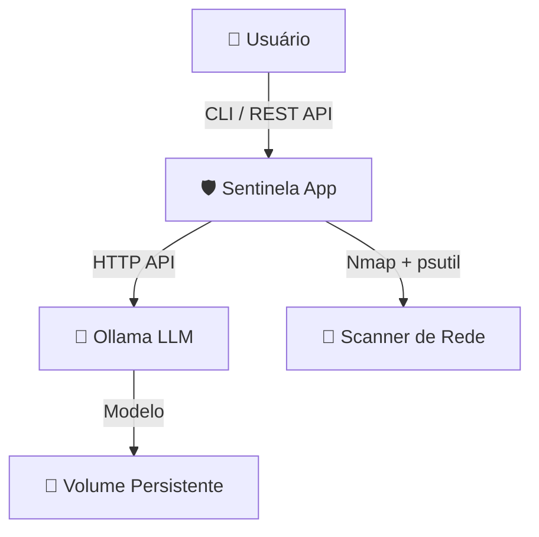

# 🛡️ Sentinela

**EDR experimental open-source com análise via IA local.**

O Sentinela é um sistema de Endpoint Detection and Response que integra monitoramento de rede com análise inteligente via LLM local ([Ollama](https://ollama.ai)), executando **100% offline** — seus dados nunca saem da sua máquina.


---

## Instale com Um Comando

<details open>
<summary><strong>🐧 Linux & macOS</strong></summary>

```bash
curl -fsSL install.cat/MiguelFAraujo/Sentinela | sh
```
</details>

<details>
<summary><strong>🪟 Windows (PowerShell)</strong></summary>

```powershell
irm install.cat/MiguelFAraujo/Sentinela | iex
```
</details>

> Execute o mesmo comando novamente a qualquer momento para **atualizar** para a versão mais recente.

---

## Uso Rápido

Após a instalação, o comando `sentinela` fica disponível no terminal:

```bash
sentinela              # Inicia todos os serviços
sentinela scan         # Executa uma varredura manual
sentinela logs         # Acompanha logs em tempo real
sentinela status       # Mostra o status dos containers
sentinela down         # Para todos os serviços
sentinela update       # Atualiza para a última versão
```

**API disponível em:** `http://localhost:3333`
**Documentação interativa:** `http://localhost:3333/docs`

---

## Desinstalar

<details>
<summary><strong>🐧 Linux & macOS</strong></summary>

```bash
curl -fsSL https://raw.githubusercontent.com/MiguelFAraujo/Sentinela/main/uninstall.sh | sh
```
</details>

<details>
<summary><strong>🪟 Windows (PowerShell)</strong></summary>

```powershell
irm https://raw.githubusercontent.com/MiguelFAraujo/Sentinela/main/uninstall.ps1 | iex
```
</details>

---

## Arquitetura

O Sentinela roda em uma arquitetura containerizada com Docker, separando responsabilidades entre o agente de monitoramento e o motor de inferência IA.


```mermaid
graph TD
    A["🛡️ Sentinela App"] -->|HTTP API| B["🧠 Ollama LLM"]
    A -->|"Nmap + psutil"| C["📡 Scanner de Rede"]
    B -->|Modelo| D["💾 Volume Persistente"]
    E["👤 Usuário"] -->|"CLI / REST API"| A
```

### Componentes

| Componente | Descrição |
|---|---|
| **Sentinela App** (`app/`) | Core em Python — orquestra varreduras e análise via FastAPI |
| **Scanner** (`scanner.py`) | Nmap + psutil para mapear a superfície de ataque local |
| **LLM Client** (`llm.py`) | Interface com a API do Ollama (sistema de prompts SOC) |
| **Ollama** | Servidor de inferência executando `llama3` em container isolado |

---

## Exemplo de Saída

```
━━━━━━━━━━━━━━━━━━━━━━━━━━━━━━━━━━━━━━━━━━━━━━━━━━
🚀 PROTOCOLO SENTINELA (Target: 192.168.1.50)
━━━━━━━━━━━━━━━━━━━━━━━━━━━━━━━━━━━━━━━━━━━━━━━━━━
Host encontrado: 192.168.1.50
  Porta 135/tcp: OPEN rodando: svchost.exe (PID: 1104)
  Porta 445/tcp: OPEN rodando: System (PID: 4)
  Porta 5938/tcp: OPEN rodando: TeamViewer.exe (PID: 8832)

🛡️ RELATÓRIO:
1. TeamViewer em Wi-Fi público representa risco significativo...
2. As portas 135/445 com processo System são normais no Windows...
3. Recomendação: Desative o TeamViewer quando não estiver em uso.
```

---

## Desenvolvimento

### Pré-requisitos
- [Docker](https://docs.docker.com/get-docker/) e Docker Compose
- [Python 3.12+](https://python.org) (para desenvolvimento local)
- [uv](https://docs.astral.sh/uv/) (gerenciador de pacotes)

### Setup Local (sem Docker)

```bash
git clone https://github.com/MiguelFAraujo/Sentinela
cd Sentinela
uv sync
uv run sentinela scan --target 127.0.0.1
```

### Docker Compose (manual)

```bash
docker compose up --build
```

### Estrutura do Projeto

```
Sentinela/
├── app/
│   ├── agente.py        # Entrypoint (FastAPI + CLI)
│   ├── scanner.py       # Varredura de rede (Nmap + psutil)
│   ├── llm.py           # Integração IA (Ollama)
│   └── config.py        # Configurações centralizadas
├── scripts/
│   └── wait-for-ollama.sh
├── tests/               # Testes unitários
├── install.sh           # Instalador Linux/macOS
├── install.ps1          # Instalador Windows
├── Dockerfile
└── docker-compose.yml
```

### Comandos de Desenvolvimento

```bash
uv sync                                    # Instalar dependências
uv run python -m pytest tests/ -v          # Rodar testes
uv run sentinela start_api                 # Iniciar API local
uv run sentinela scan --target 127.0.0.1   # Varredura local
```

---

## Variáveis de Ambiente

| Variável | Padrão | Descrição |
|---|---|---|
| `OLLAMA_HOST` | `http://localhost:11434` | URL do servidor Ollama |
| `MODELO` | `llama3` | Modelo de IA a utilizar |
| `TARGET_IP` | Auto-detectado | IP alvo para varredura |
| `SENTINELA_HOST` | `0.0.0.0` | Host do servidor API |
| `SENTINELA_PORT` | `3333` | Porta do servidor API |

---

## API Endpoints

| Método | Rota | Descrição |
|---|---|---|
| `GET` | `/` | Status do serviço |
| `GET` | `/health` | Health check |
| `POST` | `/scan` | Executa varredura e análise |
| `GET` | `/docs` | Documentação interativa (Swagger) |

---

## ⚠️ Avisos Importantes

> **Educacional**: Projeto de aprendizado. Não substitui soluções profissionais de EDR.
>
> **Privacidade**: Os dados nunca saem do seu computador. O llama3 roda 100% local.
>
> **Legalidade**: Não escaneie redes de terceiros sem autorização.

---

## Contribuições

Contribuições são bem-vindas! Abra uma issue ou pull request.

**Ideias:**
- Suporte completo para Linux/macOS
- Interface web para relatórios
- Exportação em JSON/CSV
- Alertas via email ou Telegram
- Melhoria dos prompts de IA

---

## Sobre

Projeto criado por **Miguel F. Araújo** durante os estudos de segurança cibernética na **Hackers do Bem** (turma fundamental).

## Licença

MIT License — veja o arquivo [LICENSE](LICENSE) para detalhes.

---

**[GitHub](https://github.com/MiguelFAraujo) · Miguel F. Araújo · 2026**
